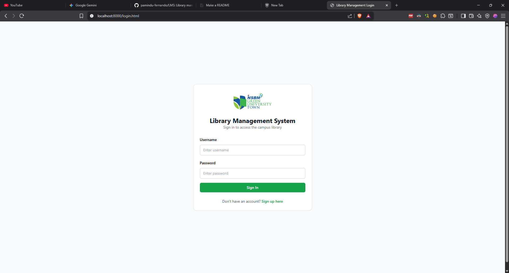
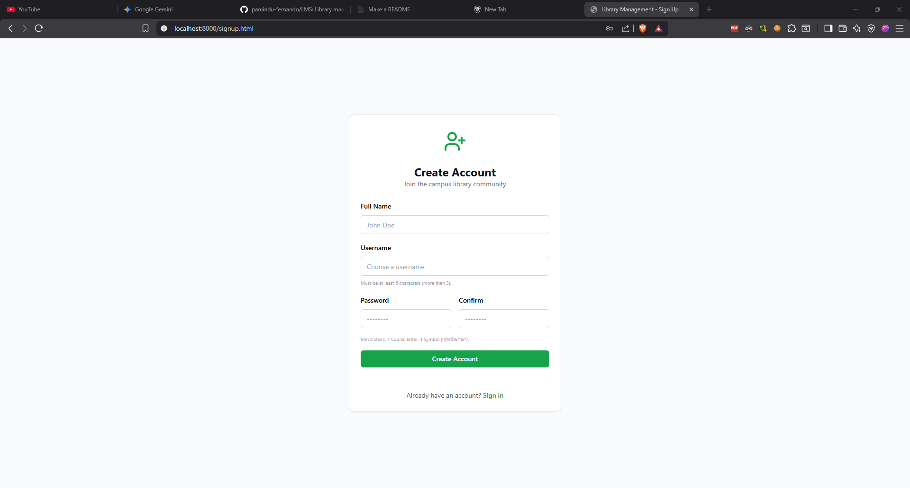
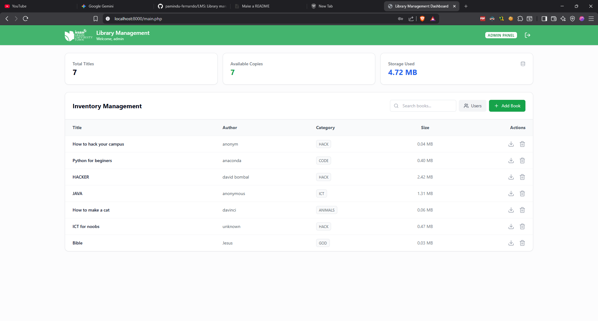
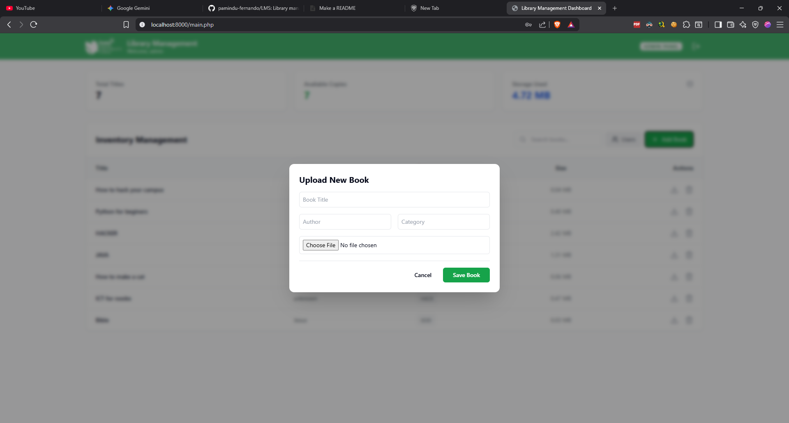
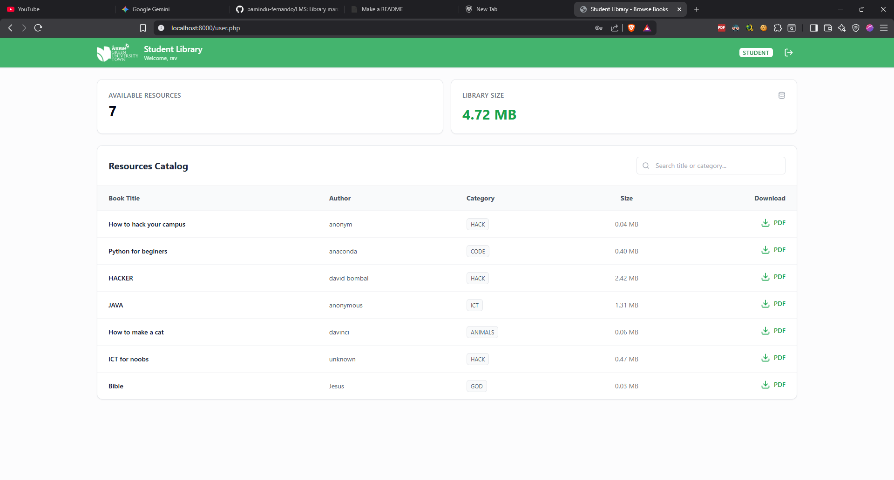
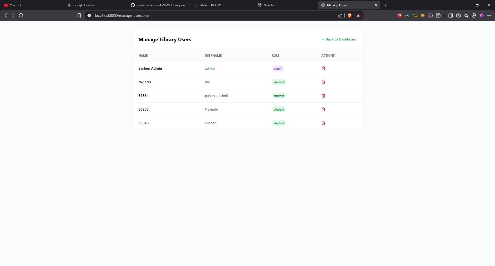

# Library Management System (NSBM)

A robust, secure system designed to streamline library operations. This platform allows admins to manage book catalogs while providing students with a secure environment to browse and download digital resources.

### Project Screenshots

| Sign in | Sign up | Admin Dashboard |
| :---: | :---: | :---: |
|  |  |  |
| **Book upload (admin)** | **User interface** | **User management (admin)** |
|  |  |  |

## Features
- **Secure Authentication:** Multi-role login system (Admin/Student) with session protection.
- **Strict Registration:** Account creation with enforced validation:
  - Username: Minimum 6 characters.
  - Password: Minimum 8 characters, including 1 Uppercase and 1 Symbol.
- **Admin Panel:** Full CRUD operations for books, PDF uploads, and user management (Delete/View).
- **User Portal:** Personalized dashboard for students to search and download resources.
- **Search & Filter:** Real-time filtering by title, author, or category.

## Tech Stack
- **Backend:** PHP
- **Frontend:** Tailwind CSS, Alpine.js, Lucide Icons
- **Database:** MySQL
- **Version Control:** Git

## Installation & Setup

1. **Clone the Repository:**

   ```bash

   git clone https://github.com/pamindu-fernando/LMS.git
   cd LMS
   ```
2. **Database Setup:**
   - Create a database named \`library_db\` (or as defined in your \`db_config.php\`).
   - Run the following SQL to set up the \`library_db\` database and setup the tables \`books\` and \`users\`.
  ```sql 

   CREATE DATABASE IF NOT EXISTS library_db;

   USE library_db;

   CREATE TABLE IF NOT EXISTS books (
      id INT AUTO_INCREMENT PRIMARY KEY,
      title VARCHAR(255) NOT NULL,
      author VARCHAR(255),
      category VARCHAR(255),
      description TEXT NULL,
      quantity INT DEFAULT 1,
      available INT DEFAULT 1,
      file_path VARCHAR(255) NOT NULL,
      uploaded_at TIMESTAMP DEFAULT CURRENT_TIMESTAMP
   );
 ```
 ```sql
  CREATE TABLE users (
    id INT AUTO_INCREMENT PRIMARY KEY,
    fullname VARCHAR(100),
    username VARCHAR(50) UNIQUE,
    password VARCHAR(255),
    role ENUM('admin', 'student') DEFAULT 'student',
    created_at TIMESTAMP DEFAULT CURRENT_TIMESTAMP
  );

 ```
- Add an admin and a user account to get started

 ```sql 
      NSERT INTO users (fullname, username, password, role)
      VALUES ('Administrator', 'admin', 'admin', 'admin');
      
      INSERT INTO users (fullname, username, password, role)
      VALUES ('User', 'user', 'user','user');

 ```
3. **⚠️ Important:**

   - Edit the \`php.ini\`
```txt
 post_max_size = 50M
 extension=mysqli
 extension_dir = "ext" //edit this part to "ext"
//uncomment ; <--- delete this
```
4. **Configure Connection:**
   - Ensure \`db_config.php\` matches your local MySQL credentials.

5. **Run Locally:**

```php
  php -S localhost:[port] //port = 8000,8080
```
   - Run above command to start the php server.
   - Access via [http://localhost:8000/login.html](http://localhost:8000/login.html)

6. **Prerequisites:**

- php ``` winget install PHP.PHP.8.5```
- mysql ```winget install Oracle.MySQL```

## Usage
- **Admins:** Use credentials (admin/admin) to access management tools.
- **Students:** Sign up for a new account using the secure registration form.

## License
Distributed under the public license.
